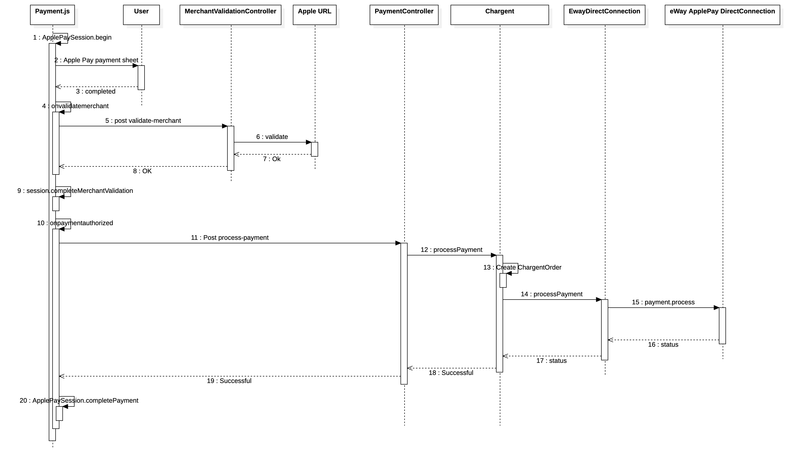

High level design:

1. Frontend Integration (JavaScript):
Implement the Apple Pay JS API in your frontend code to display the Apple Pay button and handle the payment flow.
Use JavaScript to validate the entered URL or perform any client-side checks you require.

2. Backend Implementation (Server-Side):
Develop a backend application that will receive payment data from the frontend, validate it, and communicate with the payment gateway.
This backend can be built with a server-side language/framework such as Python (using Django or Flask), Java (using Spring Boot).

3. Apple Pay Payment Processing:
The payment token generated by Apple Pay in the frontend needs to be sent securely to your backend.
In the backend, need to validate the payment token received from the frontend using Apple's server-side validation endpoint.
Once the payment token is validated, can securely transmit it to the payment gateway(SF Chargent) to process the payment.


Detailed Design:
1. Configuring Your Environment/Maintaining Your Environment
https://developer.apple.com/documentation/apple_pay_on_the_web/configuring_your_environment
https://developer.apple.com/documentation/apple_pay_on_the_web/maintaining_your_environment

2. Apple Pay Integration:
Set up the necessary HTML and JavaScript code to integrate Apple Pay into your web application.
Configure the Apple Pay session by specifying the supported payment networks, merchant capabilities, and other relevant details.
Implement the necessary event handlers, such as *onpaymentauthorized*, to capture the payment details and initiate the payment processing.
HTML:
```html
<script src="https://applepay.cdn.apple.com/jsapi/v3/apple-pay.js" type="module"></script>
```


3. Payment Authorization and Tokenization:
Use the *ApplePaySession* object to handle the *onpaymentauthorized* event and retrieve the payment token, billing contact, and shipping contact.
After calling ```ApplePaySession.begin()```, The onvalidatemerchant event handler is triggered, and the Apple Pay session needs to validate the merchant. It is responsible for sending the validation URL received from Apple Pay to the backend server for merchant validation. 
Send an HTTP request (e.g., a POST request) to your backend server, passing the payment token and other relevant details.

4. Validate merchant
On the server side, handle the request and validate the payment token with Apple's server by making a request to Apple's */validate-merchant* endpoint.

```javascript
session.onvalidatemerchant = async (event) => {
    const validationURL = event.validationURL; // The validation URL received from Apple Pay
}
```

Implement the merchant validation logic on your backend server by sending a request to Apple's /validate-merchant endpoint with the received validation URL.
Verify the response from Apple's server to ensure the validation was successful.
Extract the merchant session from the response and complete the validation process.

```java
// Create the HTTP entity with the request payload and headers
HttpEntity<String> entity = new HttpEntity<>(requestBody, headers);
// Make the HTTP POST request
RestTemplate restTemplate = new RestTemplate();
ResponseEntity<String> response = restTemplate.postForEntity("VALIDATION_URL_RECEIVED_FROM_APPLE_PAY", entity, String.class);
```

VALIDATION_URL_RECEIVED_FROM_APPLE_PAY is gotten from 
```javascript
const validationURL = event.validationURL;
```
Allow Apple Pay IP Addresses for Merchant Validation:
https://developer.apple.com/documentation/apple_pay_on_the_web/setting_up_your_server

5. Complete the validation process and present the payment sheet
After receiving the merchant session from the server, the handler calls session.completeMerchantValidation(merchantSession) to complete the merchant validation process.

```javascript 
// Complete the validation with the merchant session
session.completeMerchantValidation(merchantSession);
```

the Apple Pay payment sheet will be presented to the user. The user will see the payment options and can select their preferred payment method. They may need to authenticate using Face ID, Touch ID, or their device passcode, depending on the device and payment method chosen.

Once the user has selected a payment method and completed the authentication process, the onpaymentauthorized event will be triggered. This event provides you with the payment details, including the payment token, billing contact, shipping contact, and other relevant information

In this step, payment token is gotten from event
```javascript
session.onpaymentauthorized = async (event) => {
   const payment = event.payment; // The payment details received from Apple Pay
   const paymentToken = payment.token.paymentData; // Retrieve the payment token
}
```

The payment token is a JSON Web Token (JWT) that contains the payment information, such as the payment method, billing contact, and shipping contact. You can send the payment token to your backend server for processing.
```json
{
  "paymentToken": {
    "transactionId": "c3c72badf71ef9607542f955b82f35c72d615a3444f75d4b0cd59ad8b9b277dd",
    "paymentData": "zBGPmoTaMeRRDHXofGSiafVz3TJW6UrXGhxWrETg9pdd2ASSAwMpQcxqJZ34kzRphxJ8onUfhzRrLdEEpA1kfhCfdWE0cc63F/C9vXOlr0DGZaXzZopETh0r9WzxDUW6OhgpwDpuD9mkCbdnHfNGN5edG3G/lFnsi/bQ6PNTE2MRTYhY+cKwvGFZjeYMTYQbidWhqET2+6xyBhipHiQJn3WiMTm40H15JCg3VumGoSg5w2dGtDF4ICsakWKJZ+9mI4ALepMZsSwmD+Cag+0jVjzKHEcgpJWHCRyCyavVEgdKzPBI3BgFQbTEjPv/7hWmBJ4Ml5XbgfrQ5N80epZfbsThwuSwsxSqvjGOHzxXSeFnNXomM8aqQOVyugWeCgwHU1rCEgkacBwo5RmOah8AYbHzQMqeCUKawlOWzdMpNWI=",
    "paymentMethod": {
      "displayName": "Visa 0326",
      "network": "Visa",
      "type": "debit"
    },
    "transactionIdentifier": "C3C72BADF71EF9607542F955B82F35C72D615A3444F75D4B0CD59AD8B9B277DD"
  }
}
```
The "header" and "signature" are used to verify the integrity of the payment token. They are not mandatory in the payment token format.

```json
{
  "paymentData": {
    "data": "zBGPmoTaMeRRDHXofGSiafVz3TJW6UrXGhxWrETg9pdd2ASSAwMpQcxqJZ34kzRphxJ8onUfhzRrLdEEpA1kfhCfdWE0cc63F/C9vXOlr0DGZaXzZopETh0r9WzxDUW6OhgpwDpuD9mkCbdnHfNGN5edG3G/lFnsi/bQ6PNTE2MRTYhY+cKwvGFZjeYMTYQbidWhqET2+6xyBhipHiQJn3WiMTm40H15JCg3VumGoSg5w2dGtDF4ICsakWKJZ+9mI4ALepMZsSwmD+Cag+0jVjzKHEcgpJWHCRyCyavVEgdKzPBI3BgFQbTEjPv/7hWmBJ4Ml5XbgfrQ5N80epZfbsThwuSwsxSqvjGOHzxXSeFnNXomM8aqQOVyugWeCgwHU1rCEgkacBwo5RmOah8AYbHzQMqeCUKawlOWzdMpNWI=",
    "signature": "MIAGCSqGSIb3DQEHAqCAMIACAQExDzANBglghkgBZQMEAgEFADCB1zCB0jEuMCwGA1UEAwwlQXBwbGUgQXBwbGljYXRpb24gSW50ZWdyYXRpb24gQ0EgLSBHMzEmMCQGA1UECwwdQXBwbGUgQ2VydGlmaWNhdGlvbiBBdXRob3JpdHkxEzARBgNVBAoMCkFwcGxlIEluYy4xCzAJBgNVBAYTAlVTMB4XDTE5MDcwODAxMjI0NVoXDTM5MDcwNjAxMjI0NVowfDEkMCIGA1UEAwwbYWxsLWV4YW1wbGUuY29tL2FwcGxpY2F0aW9uXzEwggEiMA0GCSqGSIb3DQEBAQUAA4IBDwAwggEKAoIBAQDb9m4J/DYSVGlB/YZdQF0KDFroqH60pT2Qrc5p7APn9Qyyu2TMiLJXQ5XQLKxurGKxvK/UQ3ikfdxh4s9FvSXOb0mUydr/HMyh+tFTtwbtJ0FQCLXVqlySc8cN72m9ZS8uE4BYAJgWWyLCw5Cngnm90SKuDAiiy5Skev6Eogvj1sOxzkTwgEF9Q9tQw3uJc1eD42oWcDhzeoPnmV7X6uVGCyE2lzj1cK12v8QR+ggKZbAHJJRZxMTD3HLGJbnc/fJj5h2a34evoJ/lZJ2im8im3+PLqY6lzg/DgMQe9fqv4fh3qxh2oGgkkjo8MTbbDhYam+iLpPQ0Ov8qsWn0ijAgMBAAEwDQYJKoZIhvcNAQELBQADggEBAKFcq/4CPHLLyABTQGqsyGekIk3TV55w/bpYQ1q5t2DxkOIPXBn+jjg2iE55kRoMPZm7P6xtNymyYRNu5QXurY+g5CEWw1z2ZFLKl/Kx6SOQSmvsCg5iUZv0Og5WV+eQz31lnzQc48udC6ix1ILsNAnMY7KqIgce97/rqW4dRDeAH8roHwCBGFuygJp9MQgcgXImND2FbQy4rzkjvPukntMZ/kdIWstEZwohhMF+bOTUVK4vJ0+20PO4ATtttadQ+0sxn+/w6Z3JZKZ7JWKs61vA0I9zkOC7vDE2nYNZZxxApySbhzTncA3CvC05qOyHRUIK8L9A2sToqk6q7G39SU="
  },
  "header": {
    "transactionId": "abc123xyz",
    "timestamp": "2023-06-08T12:00:00Z"
  }
}
```

If user cancel the payment, the oncancel event will be triggered.
```javascript
session.oncancel = (event) => {
    // The payment was cancelled by the user
}
```
6. Upgrade Chargent version on Salesforce environments (Dev,UAT,Prod)
https://appfrontier.com/wp-content/uploads/2022/03/Chargent- Quick-Start-Guide.pdf
7. Activate Chargent on Dev and UAT. Instructed the client of the issue and advised him of steps needed.

8. Configure Chargent on UAT to be integrated with the Eway test account:
https://appfrontier.com/wp-content/uploads/2022/03/Chargent- Quick-Start-Guide.pdf

9. Connect Eway to Chargent: Once we have enabled Apple Pay on the eWay account, we will need to connect eWay to Chargent. This involves entering your eWay API keys or authentication credentials in the payment settings. This needs to be done on SF UAT sandbox, and then upgraded in prod.
To view the Eway API Key, you will need to follow these steps:
- a. Log in to your eWay account.
- b. Click on "My Account" in the top menu.
- c. Click on "API Key & Password" under "My Account."
- d. If you have not generated an API Key before, click the "Generate API Key" button.
- e. If you have already generated an API Key, it will be displayed on the "API Key & Password" page.

10. To connect Chargent in FormAssembly:
- a. Log in to your FormAssembly account. 
- b. Open the form.
- c. Drag and drop the Chargent connector into your form. 
- d. Click on the connector to open its settings.
- e. In the settings, select "eWay" as the payment gateway.
- f. Enter your eWay API key, password, and merchant ID.
- g. Under the "Payment Methods" section, select "Apple Pay" as one of your payment methods.
- h. Save your settings and test your checkout process to ensure that Apple Pay is working correctly.
- j. Create a JavaScript code to assist the user to choose fromone merchant id or other. To do

11. Test Payment form
After we have set up the payment form, we should test it to make sure that payments are being processed correctly. You can do this by making a test payment using Apple Pay and verifying that the payment is processed correctly in your eWay account. https://developer.apple.com/apple-pay/sandbox-testing/

12. Payment Processing with Chargent:
In ```onpaymentauthorized```, you can invoke the Chargent API to initiate the payment transaction.
Construct the necessary parameters (e.g., payment token, amount) and make an HTTP request to the Chargent API endpoint.
To process a payment using Chargent, you typically utilize the Chargent objects and methods provided by the library, such as creating a Charge__c record or invoking the ChargentOrder functionality. 

Then call eWay Apple Pay with Direct Connection with *payment token*
https://eway.io/api-v3/?_ga=2.218170717.594038079.1681168710-1138494502.1671142760#apple-pay-with-direct-connection

13. eWay Apple Pay with Direct Connection
The Apple Pay with Direct Connection method allows you to process payments using Apple Pay without the need for a third-party payment gateway. This method is only available for merchants in Australia and New Zealand.
```java 
RapidClient client = RapidSDK.newRapidClient(apiKey, apiPassword, isTestMode);

// Collect the payment token from the client-side (Apple Pay JS)
String paymentToken = "APPLE_PAY_PAYMENT_TOKEN";

// Prepare the payment request
Transaction transaction = new Transaction();
transaction.setPayment(paymentToken);
transaction.setTransactionType(TransactionType.Purchase);
transaction.setPaymentMethod(PaymentMethod.ApplePay);
transaction.setAmount(10.0); // Set the payment amount

// Make the payment request
Payment payment = client.create(Payment.class);
payment.setTransaction(transaction);
payment.process();

```


Process the response from the Chargent API to determine the status of the payment transaction.
Handle the success or failure of the payment processing and provide appropriate feedback to the user.

1. Apple Pay Session summarize:
-  Call *session.begin()* to present the Apple Pay payment sheet.
-  The payment sheet is presented to the user, allowing them to select their preferred payment method, enter shipping details, and review the payment details.
- Once the user has completed the necessary steps in the payment sheet, the *onvalidatemerchant* event is triggered.
- In the *onvalidatemerchant* event handler, you retrieve the validation URL from the event object and send it to your backend server for merchant validation.
- Wait for the response from the backend server.
- Once you receive the merchant session from the backend server, call *session.completeMerchantValidation(merchantSession)* to complete the validation process.
- After the merchant validation is completed, the *onpaymentauthorized* event is triggered when the user authorizes the payment.
- In the *onpaymentauthorized* event handler, you can retrieve the payment details from the event object and send them to your backend server for processing.
- Wait for the response from the backend server to determine the status of the payment processing.
- Call *session.completePayment()* with the appropriate status (success or failure) to indicate the result of the payment processing.




***Note: payment.js is using ApplePaySession API is specifically designed for use with Apple Pay on Safari browser and Safari WebView on iOS and macOS devices. It is not supported in other browsers, including Google Chrome.
If want to use Apple Pay on other browsers, use w3c payment api (*w3cpayment.html*) instead.***